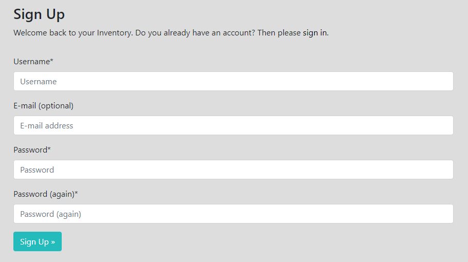
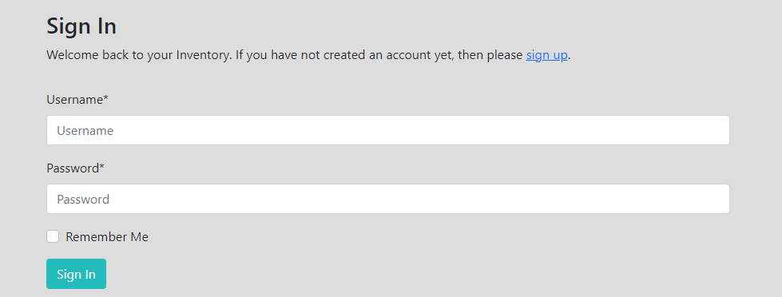
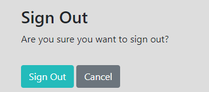

# Inventory
## Inventory is designed to help you keep track of all your items, wherever they are.
## By creating your own categories, you have the freedom of naming them as you wish.
### Open the live webpage through this [link](https://inventory-es.herokuapp.com/).

# Features


# Technology used
* HTML
* CSS
* Javascript
* Python

# Frameworks and libraries used
* Django
* Bootstrap 5
* ElephantSQL
* Cloudinary

## Testing


# User Stories

## [#1 Create an account](https://github.com/EddieStn/inventory/issues/1)
### As a Site User I want to be able to create an account so that my items are saved
* For account creation I used the all-auth library from Django.
    * That provided everything needed for registration, login and logout pages, and functionality







## [#2 Create Categories](https://github.com/EddieStn/inventory/issues/2)
### As a Site user I want to be able to create different categories so that I can add items in different categories
* To create categories, I`ve built the Category model using django.db/models and django.contrib.auth.models/User libraries as imports
    * index view, url and template handles the category, items and forms
        * Category model
            ```
            from django.db import models
            from django.contrib.auth.models import User


            class Category(models.Model):
                user = models.ForeignKey(User, default=1, on_delete=models.CASCADE,
                                        related_name='category', null=True)
                name = models.CharField(max_length=100, null=False, blank=False)
                slug = models.SlugField(max_length=100, blank=True, null=True)
                created_on = models.DateTimeField(auto_now_add=True)
                timestamp = models.DateTimeField(auto_now=True)

                class Meta:
                    ordering = ['-timestamp']
                    verbose_name = 'category'
                    verbose_name_plural = 'categories'

                def __str__(self):
                    return self.name

                def get_absolute_url(self):
                    return reverse('category_detail', kwargs={'slug': self.slug})
            ```
        * Category, Item and Forms view
            ```
            @login_required
            def index(request):

                categories = Category.objects.filter(user=request.user)
                items = Item.objects.filter(user=request.user)
                add_item = ItemForm(request.user)
                add_category = CategoryForm(user=request.user)
                query = None

                if request.method == 'POST':
                    if 'add_item' in request.POST:
                        add_item = ItemForm(request.user, request.POST)
                        if add_item.is_valid():
                            add_item.instance.category = get_object_or_404(Category, name=request.POST.get('category'), user=request.user)
                            add_item.instance.user = request.user
                            add_item.save()
                            name = add_item.cleaned_data.get('name')
                            messages.success(request, f'{name} has been added')
                            return redirect('home')
                    else:
                        add_category = CategoryForm(user=request.user, data=request.POST)
                        if add_category.is_valid():
                            add_category.instance.user = request.user
                            add_category.save()
                            name = add_category.cleaned_data.get('name')
                            messages.success(request, f'{name} has been added')
                            return redirect('home')

                if request.GET:
                    if 'q' in request.GET:
                        query = request.GET['q']
                        if not query:
                            messages.error(
                                request, "You didn't enter any search criteria!")
                            return redirect(reverse('home'))
                        queries = Q(name__icontains=query) | Q(notes__icontains=query)
                        items = items.filter(queries)
                        if not items:
                            messages.error(request, "You don`t have that item")
                            return redirect('home')
                    if 'category' in request.GET:
                        category = get_object_or_404(
                            Category, name=request.GET.get('category'), user=request.user)
                        items = Item.objects.filter(category=category)

                context = {
                    'items': items,
                    'search_term': query,
                    'add_item': add_item,
                    'add_category': add_category,
                    'categories': categories
                }
                return render(request, 'index.html', context)
            ```
        * Category, items and forms url
            ```
            path('', views.index, name='home'),
            ```
        * Category and form template ( index.html )
            ```
            <div class="catParentDiv">
                
                <div class="catDivs bg-submenu d-flex justify-content-end">
                    <a class="link px-2 catName" href="?category={{category.name}}">{{ category.name }}</a>
                    <a class="btn btn-info btn-sm me-0 d-flex align-items-center"
                    href="">Edit</a>
                    <a class="btn btn-danger btn-sm me-0 d-flex align-items-center"
                    href="">Delete</a>
                </div>
                <hr>
                
            </div>
            
            <div class="bg-submenu mt-3 p-2">
                <form method="POST">
                    <h5>Add new Category</h5>
                    
                    {{ add_category|crispy }}
                    <div class="d-flex justify-content-center">
                        <button class="btn btn-info btn-sm" type="submit">Add Category</button>
                    </div>
                </form>
            </div>
            ```
        
## [#3 Add Items](https://github.com/EddieStn/inventory/issues/3)
### As a Site Admin / User I can create items so that I can keep track of them
* To add items, I've created the Item model with an FK to the Category model
    * That will make it possible to add items to different categories
        * Model
            ```
            class Item(models.Model):
                user = models.ForeignKey(User, default=1, on_delete=models.CASCADE,
                                        related_name='item', null=True)
                name = models.CharField(max_length=100, null=False, blank=False)
                notes = models.TextField(blank=True, null=True)
                quantity = models.PositiveIntegerField(default=0)
                created_on = models.DateTimeField(auto_now_add=True)
                timestamp = models.DateTimeField(auto_now=True)
                category = models.ForeignKey(Category, on_delete=models.CASCADE, null=True)

                class Meta:
                    ordering = ['-timestamp']

                def __str__(self):
                    return self.name
            ```
        * View ( check User story #2 view)
        * Url
            ```
            path('', views.index, name='home'),
            ```
        * Template ( index.html )
            ```
            <form method="POST" class="bg-submenu p-2">
                <h5>Add new Item</h5>
                
                <input name="add_item" type="hidden" value="add_item">
                {{ add_item.name | as_crispy_field }}
                {{ add_item.quantity | as_crispy_field }}
                <select name="category" required>
                    
                    <option value="{{ category.name }}">{{ category.name }}</option>
                    
                </select>
                {{ add_item.notes | as_crispy_field }}
                <div class="d-flex justify-content-center">
                    <button class="btn btn-info btn-sm" type="submit">Add Item</button>
                </div>
            </form>

            <div class="row">
                <h2> You have {{ items|length }} item(s) here! </h2>
                
                
                    <div class="itemDivs light-bg">
                        <h2 class="d-flex justify-content-center item-name">{{item.name}}</h2>
                        <h6 class="d-flex justify-content-center item-p">Qty: {{item.quantity}}</h6>
                        <h6 class="d-flex justify-content-center item-p"><i class="fa-regular fa-at"></i>: {{item.category}}</h6>
                        <h6 class="d-flex justify-content-center item-p"><i class="fa-regular fa-pen-to-square"></i>: {{item.notes}}</h6>
                        <p class="d-flex justify-content-center">
                            <a class="btn btn-info btn-sm"
                            href="">Edit</a>
                        </p>
                        <p class="d-flex justify-content-center">
                            <a class="btn btn-danger btn-sm"
                            href="">Delete</a>
                        </p>
                    </div>
                
                
            </div>
            ```

## [#4 Update Items](https://github.com/EddieStn/inventory/issues/4)
### As a Site User I want to be able to update the added items so that I can edit or delete them
* To update items, I`ve created 2 views, urls and templates, one for edit and one for delete
    * Edit view
        ```
        @login_required
        def item_edit(request, pk):
            item = Item.objects.get(id=pk)
            if request.method == 'POST':
                form = ItemForm(request.POST, instance=item)
                if form.is_valid():
                    form.save()
                    messages.info(request, f'{item.name} has been updated!')
                    return redirect('home')
            else:
                form = ItemForm(instance=item)
            context = {
                'form': form,
            }
            return render(request, 'item_edit.html', context)
        ```
    * Edit url
        ```
        path('edit/<int:pk>', views.item_edit, name='item-edit'),
        ```
    * Edit template
        ```
        
         Edit Item 
        

        
        <div class="container">
            <div class="row mt-5">
                <div class="col-md-6 offset-md-3">
                    <div class="border bg-white p-3">
                        <h3>Edit Item</h3>
                        <hr>
                        
                        <form method="POST">
                            
                            {{ form|crispy }}
                            <a class="btn btn-secondary" href="">Cancel</a>
                            <input class="btn btn-info" type="submit" value="Save">
                        </form>
                    </div>
                </div>
            </div>
        </div>
        
        ```
    * Delete View
        ```
        @login_required
        def item_delete(request, pk):
            item = Item.objects.get(id=pk)
            if request.method == 'POST':
                item.delete()
                messages.error(request, f'{item.name} has been deleted!')
                return redirect('home')
            return render(request, 'item_delete.html')
        ```
    * Delete Url
        ```
        path('delete/<int:pk>', views.item_delete, name='item-delete'),
        ```
    * Delete Template
        ```
        
         Delete Item 

        
        <div class="container">
            <div class="row mt-5">
                <div class="col-md-6 offset-md-3">
                    <div class="border bg-white p-3">
                        <h3>Delete Item</h3>
                        <hr>
                        <div class="alert alert-danger">
                            <h4>Are you sure you want to delete this item?</h4>
                        </div>
                        <form method="POST">
                            
                            {{ form }}
                            <a class="btn btn-secondary" href="">Cancel</a>
                            <input class="btn btn-danger" type="submit" value="Confirm">
                        </form>
                    </div>
                </div>
            </div>
        </div>
        
        ```

## [#5 Sort items](https://github.com/EddieStn/inventory/issues/5)
### As a Site User I want to be able to see the most recent items created first so that I can easily see what I've just added
* To sort items by most recent, I've added the DateTimeField in the Item model
```
created_on = models.DateTimeField(auto_now_add=True)
timestamp = models.DateTimeField(auto_now=True)

class Meta:
    ordering = ['-timestamp']
```

## [#6 Filter items](https://github.com/EddieStn/inventory/issues/6)
### As a Site User I want to be able to filter and search for items so that I can find them quicker
* The filtering and searching are handled by index view and template
    * Filtering items by category is done by clicking on a category name, this will redirect to the specific category url
        * Filtering & Searching View ( check user story #2 for the entire view )
            ```
            if request.GET:
                if 'q' in request.GET:
                    query = request.GET['q']
                    if not query:
                        messages.error(
                            request, "You didn't enter any search criteria!")
                        return redirect('home')
                    queries = Q(name__icontains=query) | Q(notes__icontains=query)
                    items = items.filter(queries)
                    if not items:
                        messages.error(request, "You don`t have that item")
                        return redirect('home')
                if 'category' in request.GET:
                    category = get_object_or_404(
                        Category, name=request.GET.get('category'), user=request.user)
                    items = Item.objects.filter(category=category)
            ```
        * Filtering Template ( in the category section )
            ```
            <a class="link px-2 catName" href="?category={{category.name}}">{{ category.name }}</a>
            ```            
        * Searching Template
            ```
            <form class="searchBar" method="GET" action="">
                <div class="input-group m-3 light-bg">
                    <input class="form-control border border-black rounded-0" type="text" name="q" placeholder="Search for items">
                    <div class="input-group-append btn-group">
                        <button class="form-control btn btn-black border border-black rounded-0 " type="submit">
                            <span class="icon">
                                <i class="fas fa-search"></i>
                            </span>
                        </button>
                        <button class="form-control btn btn-black border border-black rounded-0 " type="submit">
                            <span class="icon">
                                <i class="fa-solid fa-backward"></i>
                            </span>
                        </button>
                    </div>
                </div>
            </form>
            ```

## [#7 Manage Inventory](https://github.com/EddieStn/inventory/issues/7)
### As a Site Admin I can create, read, update and delete items and categories so that I can manage my inventory
* Full CRUD functionality is acquired by the previews views mentioned
* For the admin panel (in admin.py ):
```
from django.contrib import admin
from .models import Item, Category

admin.site.site_header = 'Inventory'


class ItemAdmin(admin.ModelAdmin):
    list_display = ('user', 'quantity', 'name', 'category', 'notes', )
    list_filter = ('category', 'created_on')


class CategoryAdmin(admin.ModelAdmin):
    prepopulated_fields = {'slug': ('name',)}
    list_display = ('name', )


admin.site.register(Item, ItemAdmin)
admin.site.register(Category, CategoryAdmin)
```

## [#9 View Items](https://github.com/EddieStn/inventory/issues/9)
### As a Site user I can view a list of items so that I can interact with them
* After creating items, they will be displayed on the home page
    * This is being being handled by the index view and index.html template

## [#10 Private Access](https://github.com/EddieStn/inventory/issues/10)
### As a Site User I want to be able to see only the items and categories that I create so that my inventory will be private and not accessed by someone else
* Each user will only have access to their own items and categories
    * This is being handled by adding user in the models with FK to User model from django.contrib.auth.models library,
        ```
        class Category(models.Model):
            user = models.ForeignKey(User, default=1, on_delete=models.CASCADE,
                            related_name='category', null=True)

        class Item(models.Model):
        user = models.ForeignKey(User, default=1, on_delete=models.CASCADE,
                            related_name='item', null=True)
        ```
    * By the index view ( check User story #2 view )
    * And in the index template
        ```
        
            
                <div class="itemDivs light-bg">
                    <h2 class="d-flex justify-content-center item-name">{{item.name}}</h2>
                    <h6 class="d-flex justify-content-center item-p">Qty: {{item.quantity}}</h6>
                    <h6 class="d-flex justify-content-center item-p"><i class="fa-regular fa-at"></i>: {{item.category}}</h6>
                    <h6 class="d-flex justify-content-center item-p"><i class="fa-regular fa-pen-to-square"></i>: {{item.notes}}</h6>
                    <p class="d-flex justify-content-center">
                        <a class="btn btn-info btn-sm"
                        href="">Edit</a>
                    </p>
                    <p class="d-flex justify-content-center">
                        <a class="btn btn-danger btn-sm"
                        href="">Delete</a>
                    </p>
                </div>
            
        
        ```

# Bugs

* BUG: 
    * Every refresh resubmits the form
    * fix:
        *   ```
            if request.method == 'POST':
                    if 'add_item' in request.POST:
                        add_item = ItemForm(request.POST)
                        if add_item.is_valid():
                            add_item.save()
                            return redirect('home') <!-- This line fixed the bug -->
            ```

* BUG:
    * All items created by other users would be saved for the superuser in the database
    * fix: 
        *   ```
            if 'add_item' in request.POST:
                add_item = ItemForm(request.user, request.POST)
                if add_item.is_valid():
                    add_item.instance.category = get_object_or_404(Category, name=request.POST.get('category'), user=request.user)
                    add_item.instance.user = request.user  <!-- This line fixed the bug -->
                    add_item.save()
            ```

# Credits 

* Search form is inspired from the Boutique-Ado project

# Acknowledgements

* Thanks to my mentor Chris Quinn for guidance
* Thanks to Code Institute tutors, for helping me with filtering, user-specific pages and bug fixes
* Thanks to Mounir for answering my [stack overflow post](https://stackoverflow.com/questions/75208985/handling-form-fields-in-django-for-logged-in-user)
* Thanks to Roman Rakic for discovering the bug in my code - [slack thread](https://code-institute-room.slack.com/archives/C026PTF46F5/p1673898571942309)