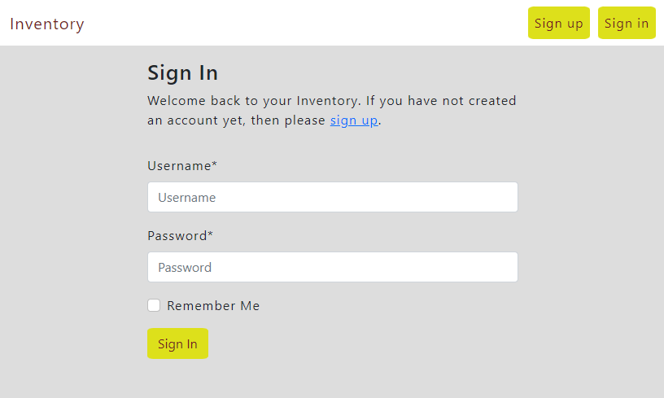
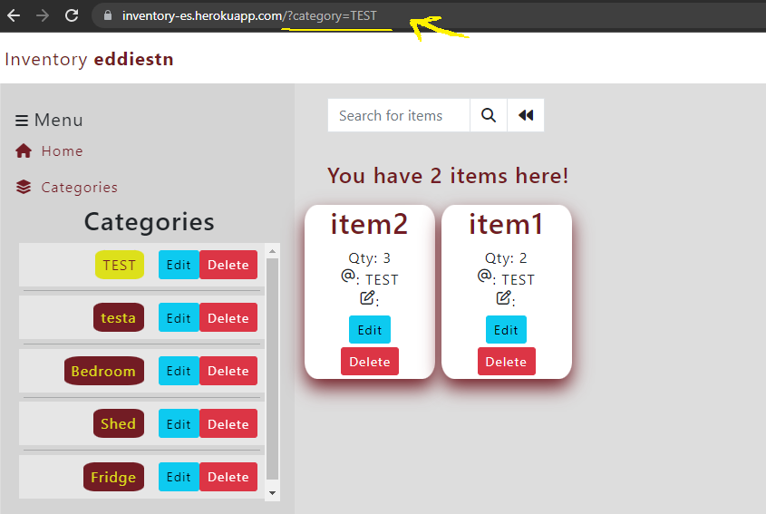

# [Inventory](https://inventory-es.herokuapp.com/)
## Inventory is designed to help you keep track of all your items, wherever they are. By creating your own categories, you have the freedom of naming them as you wish.
### Open the live webpage through this [link](https://inventory-es.herokuapp.com/).


# Table of contents
* [Design and Build](#design-and-build)
* [Features](#features)
* [Technology and framerworks](#technology)
* [Testing](#testing)
    * [Lighthouse](#lighthouse)
    * [Validation](#validation)
    * [Manual Testing](#manual-testing)
    * [Responsiveness](#responsive)
* [Bugs](#bugs)
* [User stories](#user-stories)
* [Development and Deployment](#development-and-deployment)
    * [Local development](#local-development)
    * [Deployment](#heroku-deployment)
* [Credits](#credits)
* [Acknowledgements](#acknowledgements)

# Design and build
## I've created a diagram for my finalized Django project using Django Graphviz to illustrate the connections between different applications of the project


[Graphviz SVG file](https://github.com/EddieStn/inventory/tree/main/media/images/graphviz.svg)

## Wireframes
### In my original design, I had a table for the category and item entries, but later I changed it because I had to make them very small to be responsive. Only now I realise that for mobile users it wouldn`t have been such a big issue.

* Original design - tables instead of cards


* Finished product - flexible cards


## Model Diagrams


# Features
### Given that the website requires a user to be logged in, the first page is the log-in/signup
* Tip: Remember your credentials, as forgotten password is not yet implemented




### After logging in you'll be greeted by the home page (landing page) where you are given instructions on how to use the website


## Navbar 
* Logo `Inventory` < **username** >
* Sign-in and Sign-up / Logout


* Friendly messages to alert you of the actions made


## Sidebar is the place where most of the action takes place.
On mobile devices, the sidebar is shrunk, showing only the icons. Clicking on the icons will make it larger with that specific section collapsed.


* Home button
    * Redirects the user back to the home page
* Categories
    * Collapsable button for `categories` view and add `new category` form


* Add Items
    * Collapsable button for `Add Item` form


* Categories entry
    * Categories are clickable and are used to filter all items created for a specific category



    * When categories become too many, a scrollable bar will help you access the ones further down
    * The Edit button will allow you to change the category name


    * The Delete button will delete the category **and** `ALL ITEMS` belonging to it


* Add new category form
    * You cannot create categories with the same name or with no name


* Item form
    * To create a new item you need to give it a name, quantity, category and notes(optional)
    * Adding a new Item is dependant on a category, you cannot add items without a category

### Item entries
* Once an item is created, it will be displayed on the main page, along with the search bar
* Items can be edited/updated and/or deleted
* You can search for items or you can filter them by clicking on a category
* Once in a specific category, clicking the home button will take you back to all items
* Item counter tells you how many items you have created


* Editing an item will pop up the Edit Item page where you can update all the fields


* Deleting an item will pop up the Delete Item page where you're being asked if you're sure of your actions


## Features to be implemented in the future

* Profile page
* Forgot password page
* Alerts via email/text to remind you when you're running low on items
* Links to external sources to buy more of a certain item
* Create an item page and expand so you can upload an image of the item and a link to a seller

# Technology used
* HTML
* CSS
* Javascript
* Python

# Frameworks and libraries used
* Django
* Jquery
* Bootstrap 5
* ElephantSQL
* Cloudinary

# Testing

## Lighthouse
* Desktop before and aftrer


* Mobile before and after


* I improved the results by adding Meta tags and aria-label to my buttons and links
* Accessibility result is low because it is pointing to some inputs that don't exist, or I don't know what to look for


## Validation

* HTML Validation on all pages passed with no errors - [result](https://validator.w3.org/nu/?doc=https%3A%2F%2F8000-eddiestn-inventory-h6ai0tvvbaf.ws-eu84.gitpod.io%2Faccounts%2Flogin%2F%3Fnext%3D%2F)


* CSS Validation passed with no errors - [result](https://jigsaw.w3.org/css-validator/validator?uri=https%3A%2F%2F8000-eddiestn-inventory-h6ai0tvvbaf.ws-eu84.gitpod.io%2F&profile=css3svg&usermedium=all&warning=1&vextwarning=&lang=en)
    * Most of my CSS comes from Bootstrap 5


* JShit check for javascript passed with no errors.
    * To make it work properly for ES6, pass this code at the top: `/* jshint esversion: 6 */`


* Pep8online was down during the validation process, nevertheless, with the built-in pep8 validator pycodestyle, there are no errors (except for settings.py).


## Manual testing
### For this project I performed manual tests, and they are as follows:

### For User Story [#1 Create account](https://github.com/EddieStn/inventory/issues/1)
As a Site User I want to be able to create an account so that my items are saved

* Sign-up, Sign-in, Logout pages
    * Testing registering with a username taken, blank username/password, too short password, password containing unallowed characters
    * Testing logging in with the wrong credentials and blank inputs
    * All tests passed


### Testing buttons
* Sign Up button in the nav
    * Expected output: Bring up the Sign up page
    * Actual output: Expectation confirmed

* Sign in button in the nav
    * Expected output: Bring up the Sign in page
    * Actual output: Expectation confirmed

* Sign Up button in the Sign up form
    * Expected output: 
        * Form valid > Create account
        * Form invalid > Alert user of invalid inputs
    * Actual output: Expectation confirmed

* Sign in button in the Sign in form
    * Expected output:
        * Form valid -> Log in to your account
        * Form invalid -> Alert user of the invalid inputs
    * Actual output: Expectation confirmed

* Logout button in the nav
    * Expected output: Bring up the logout page allowing the user to confirm
    * Actual output: Expectation confirmed

* Sign out button in the Logout page
    * Expected output: Logout
    * Actual output: Expectation confirmed

* Cancel button in the Logout page
    * Expected output: Redirect to home page
    * Actual output: Expectation confirmed

### For User Story [#2 Create categories](https://github.com/EddieStn/inventory/issues/2)
As a Site user I want to be able to create different categories so that I can add items in different categories
### Testing buttons
* Category link in the sidebar
    * Expected output: 
        * Bring up the category entries and form
        * Clicking again will collapse the category entries and form
    * Actual output: Expectation confirmed

* Add category button in the category form
    * Expected output: 
        * Form valid -> Create category
        * Form invalid -> Alert user of the invalid input

* Category name link
    * Expected output: Bring up the clicked category page with the corresponding items
    * Actual output: Expectation confirmed

* Category Edit button
    * Expected output: Bring up the Edit category form page
    * Actual output: Expectation confirmed

* Category Delete button
    * Expected output: Bring up the Delete category confirmation page
    * Actual output: Expectation confirmed

* Category form validation


* Category name validation
    * A name too long will break through the container


* Fixed by adding this css code to the category name
    ```
    max-height: 4em;
    word-break: break-all;
    overflow: hidden;
    ```
* This will cut out most of the text, only showing the users a sample
    * What I should've done is have a smaller size for max_length instead of 100 characters


### For User Story [#3 Add items](https://github.com/EddieStn/inventory/issues/3)
As a Site Admin / User I can create items so that I can keep track of them

### Testing buttons
* Add items link in the sidebar menu
    * Expected output: 
        * Bring up the Add item form
        * Clicking again will collapse the Add item form
    * Actual output: Expectation confirmed

* Add Item button in the form
    * Expected output: 
        * Form valid -> Create the item
        * Form invalid -> Alert the user of the invalid input
    * Actual output: Expectation confirmed

* Add Item form validation
    * Name field is required
    * Quantity is required, but 0 is a valid input. This is a design choice as users might want to create a category of items they don't have
    * Category is required, the latest category created will be displayed as default
    * Notes is optional

* Category name too long in the item form handled by Bootstrap class `class="form-select form-select-sm"` as it is a `<select>` tag


### For User Story [#4 Update Items](https://github.com/EddieStn/inventory/issues/4)
As a Site User I want to be able to update the added items so that I can edit or delete them
* Items created are being displayed on the main page


### Testing buttons

* Edit button
    * Expected output: Bring up the Edit item form page
    * Actual output: Expectation confirmed

* Edit item form page
    * Expected output:
        * Save button will save the updated item and redirect to home page
        * Cancel button will cancel any changes and redirect the user back to home page 
    * Actual output: Expectation confirmed 

* Delete button
    * Expected output: Bring up the Delete item confirmation page
    * Actual output: Expectation confirmed

* Delete Item page
    * Expected output:
        * Delete button will delete the item
        * Cancel button will redirect the user back to home page
    * Actual output: Expectation confirmed

* Item validation
    * I designed the item containers as follows
        * To prevent text from breaking outside of their containers
        ```
        .itemDivs {
            border-radius: 10%;
            margin: .2em;
            max-width: 8em;
            box-shadow: 0 10px 20px #721c24;
            max-height: fit-content;
            word-break: break-all;
        }
        ```


### For User Story [#5 Sort items](https://github.com/EddieStn/inventory/issues/5)
As a Site User I want to be able to see the most recent items created first so that I can easily see what I`ve just added

* Due to having [-timestamp] in the Item model Meta class, the most recent created/updated item will be displayed first
```
created_on = models.DateTimeField(auto_now_add=True)
timestamp = models.DateTimeField(auto_now=True)

class Meta:
    ordering = ['-timestamp']
```
* Result: PASS

### For User Story [#6 Filter items](https://github.com/EddieStn/inventory/issues/6)
As a Site User I want to be able to filter and search for items so that I can find them quicker

* Expected output:
    * Clicking on a category name will direct the user to a new page `/?category=category-name` with all the items corresponding to it
    * Searching for a query will display only the item or items containing the query in the name or in the notes
* Actual output: Expectation confirmed

### Testing search bar buttons
* Search icon button
    * Expected output:
        * Input for existing query -> Show only the item/items containing the query
        * Input for non-existing query -> Alert user that the item does not exist
        * Input blank -> Alert user that it was an invalid request
    * Actual output: Expectation confirmed
* Back button 
    * Expected output: Redirect user back to home page with all of the items
    * Actual output: Expectation confirmed

### For User Story [#7 Manage Inventory](https://github.com/EddieStn/inventory/issues/7)
As a Site Admin I can create, read, update and delete items and categories so that I can manage my inventory

* Expected output: I can have full CRUD functionality on the admin panel
* Actual output: Expectation confirmed

### For User Story [#9 View Items](https://github.com/EddieStn/inventory/issues/9)
As a Site user I can view a list of items so that I can interact with them

* Expected output: All items are displayed nicely on the home page
* Actual output: Expectation confirmed

### For User Story [#10 Private access](https://github.com/EddieStn/inventory/issues/10)
As a Site User I want to be able to see only the items and categories that I create so that my inventory will be private and not accessed by someone else

* Expected output: The logged in user can view only his categories and items
* Actual output: Expectation confirmed

## Responsive

### No problems found when building the app and manually checking for responsiveness with chrome dev tools

To generate a multi device mockup I used [Techsini](https://techsini.com/multi-mockup/index.php)

To ensure my website is fully responsive I used [responsivedesignchecker](https://responsivedesignchecker.com/)
* Mobile


* Tablet


* Laptop


* Desktop


# Bugs

* Every refresh resubmits the form
    * fix:
        *   ```
            if request.method == 'POST':
                    if 'add_item' in request.POST:
                        add_item = ItemForm(request.POST)
                        if add_item.is_valid():
                            add_item.save()
                            return redirect('home') <!-- This line fixed the bug -->
            ```


* All items created by other users would be saved for the superuser in the database
    * fix: 
        *   ```
            if 'add_item' in request.POST:
                add_item = ItemForm(request.user, request.POST)
                if add_item.is_valid():
                    add_item.instance.category = get_object_or_404(Category, name=request.POST.get('category'), user=request.user)
                    add_item.instance.user = request.user  <!-- This line fixed the bug-->
                    add_item.save()
            ```

* Getting `Forbidden 403 CSRF verification failed` when trying to get website responsiveness from Multi-devices generator websites
    * The attempts of fixing it:
        * Add to settings.py `X_FRAME_OPTIONS = 'ALLOW-FROM https://amiresponsive.co.uk/'`
        * Add `CSRF_TRUSTED_ORIGINS = ['https://amiresponsive.co.uk/']`  `CSRF_COOKIE_SECURE = True`
        * Added to my views the `@xframe_options_excempt` decorator
            * All turned unsuccessful
            * Later I learned that you cannot submit forms from your website inside iframes of other websites(not easily done, anyway), and as my website is login required, I couldn't access it
    * Fix: 
        * I had to remove everything that was user/login related from my views, settings and template so I was able access my website in a multi-device mockup generator without logging in


# User Stories

## [#1 Create an account](https://github.com/EddieStn/inventory/issues/1)
### As a Site User I want to be able to create an account so that my items are saved
* For account creation I used the all-auth library from Django.
    * That provided everything needed for registration, login and logout pages, and functionality


## [#2 Create Categories](https://github.com/EddieStn/inventory/issues/2)
### As a Site user I want to be able to create different categories so that I can add items in different categories
* To create categories, I`ve built the Category model using django.db/models and django.contrib.auth.models/User libraries as imports
    * index view, url and template handles the category, items and forms
        * Category model
            ```
            from django.db import models
            from django.contrib.auth.models import User


            class Category(models.Model):
                user = models.ForeignKey(User, default=1, on_delete=models.CASCADE,
                                        related_name='category', null=True)
                name = models.CharField(max_length=100, null=False, blank=False)
                slug = models.SlugField(max_length=100, blank=True, null=True)
                created_on = models.DateTimeField(auto_now_add=True)
                timestamp = models.DateTimeField(auto_now=True)

                class Meta:
                    ordering = ['-timestamp']
                    verbose_name = 'category'
                    verbose_name_plural = 'categories'

                def __str__(self):
                    return self.name

                def get_absolute_url(self):
                    return reverse('category_detail', kwargs={'slug': self.slug})
            ```
        * Category, Item and Forms view
            ```
            @login_required
            def index(request):

                categories = Category.objects.filter(user=request.user)
                items = Item.objects.filter(user=request.user)
                add_item = ItemForm(request.user)
                add_category = CategoryForm(user=request.user)
                query = None

                if request.method == 'POST':
                    if 'add_item' in request.POST:
                        add_item = ItemForm(request.user, request.POST)
                        if add_item.is_valid():
                            add_item.instance.category = get_object_or_404(Category, name=request.POST.get('category'), user=request.user)
                            add_item.instance.user = request.user
                            add_item.save()
                            name = add_item.cleaned_data.get('name')
                            messages.success(request, f'{name} has been added')
                            return redirect('home')
                    else:
                        add_category = CategoryForm(user=request.user, data=request.POST)
                        if add_category.is_valid():
                            add_category.instance.user = request.user
                            add_category.save()
                            name = add_category.cleaned_data.get('name')
                            messages.success(request, f'{name} has been added')
                            return redirect('home')

                if request.GET:
                    if 'q' in request.GET:
                        query = request.GET['q']
                        if not query:
                            messages.error(
                                request, "You didn't enter any search criteria!")
                            return redirect(reverse('home'))
                        queries = Q(name__icontains=query) | Q(notes__icontains=query)
                        items = items.filter(queries)
                        if not items:
                            messages.error(request, "You don`t have that item")
                            return redirect('home')
                    if 'category' in request.GET:
                        category = get_object_or_404(
                            Category, name=request.GET.get('category'), user=request.user)
                        items = Item.objects.filter(category=category)

                context = {
                    'items': items,
                    'search_term': query,
                    'add_item': add_item,
                    'add_category': add_category,
                    'categories': categories
                }
                return render(request, 'index.html', context)
            ```
        * Category, items and forms url
            ```
            path('', views.index, name='home'),
            ```
        * Category and form template ( index.html )
            ```
            <div class="catParentDiv">
                
                <div class="catDivs bg-submenu d-flex justify-content-end">
                    <a class="link px-2 catName" href="?category={{category.name}}">{{ category.name }}</a>
                    <a class="btn btn-info btn-sm me-0 d-flex align-items-center"
                    href="">Edit</a>
                    <a class="btn btn-danger btn-sm me-0 d-flex align-items-center"
                    href="">Delete</a>
                </div>
                <hr>
                
            </div>
            
            <div class="bg-submenu mt-3 p-2">
                <form method="POST">
                    <h5>Add new Category</h5>
                    
                    {{ add_category|crispy }}
                    <div class="d-flex justify-content-center">
                        <button class="btn btn-info btn-sm" type="submit">Add Category</button>
                    </div>
                </form>
            </div>
            ```
        
## [#3 Add Items](https://github.com/EddieStn/inventory/issues/3)
### As a Site Admin / User I can create items so that I can keep track of them
* To add items, I've created the Item model with an FK to the Category model
    * That will make it possible to add items to different categories
        * Model
            ```
            class Item(models.Model):
                user = models.ForeignKey(User, default=1, on_delete=models.CASCADE,
                                        related_name='item', null=True)
                name = models.CharField(max_length=100, null=False, blank=False)
                notes = models.TextField(blank=True, null=True)
                quantity = models.PositiveIntegerField(default=0)
                created_on = models.DateTimeField(auto_now_add=True)
                timestamp = models.DateTimeField(auto_now=True)
                category = models.ForeignKey(Category, on_delete=models.CASCADE, null=True)

                class Meta:
                    ordering = ['-timestamp']

                def __str__(self):
                    return self.name
            ```
        * View ( check User story #2 view)
        * Url
            ```
            path('', views.index, name='home'),
            ```
        * Template ( index.html )
            ```
            <form method="POST" class="bg-submenu p-2">
                <h5>Add new Item</h5>
                
                <input name="add_item" type="hidden" value="add_item">
                {{ add_item.name | as_crispy_field }}
                {{ add_item.quantity | as_crispy_field }}
                <select name="category" required>
                    
                    <option value="{{ category.name }}">{{ category.name }}</option>
                    
                </select>
                {{ add_item.notes | as_crispy_field }}
                <div class="d-flex justify-content-center">
                    <button class="btn btn-info btn-sm" type="submit">Add Item</button>
                </div>
            </form>

            <div class="row">
                <h2> You have {{ items|length }} item(s) here! </h2>
                
                
                    <div class="itemDivs light-bg">
                        <h2 class="d-flex justify-content-center item-name">{{item.name}}</h2>
                        <h6 class="d-flex justify-content-center item-p">Qty: {{item.quantity}}</h6>
                        <h6 class="d-flex justify-content-center item-p"><i class="fa-regular fa-at"></i>: {{item.category}}</h6>
                        <h6 class="d-flex justify-content-center item-p"><i class="fa-regular fa-pen-to-square"></i>: {{item.notes}}</h6>
                        <p class="d-flex justify-content-center">
                            <a class="btn btn-info btn-sm"
                            href="">Edit</a>
                        </p>
                        <p class="d-flex justify-content-center">
                            <a class="btn btn-danger btn-sm"
                            href="">Delete</a>
                        </p>
                    </div>
                
                
            </div>
            ```

## [#4 Update Items](https://github.com/EddieStn/inventory/issues/4)
### As a Site User I want to be able to update the added items so that I can edit or delete them
* To update items, I`ve created 2 views, urls and templates, one for edit and one for delete
    * Edit view
        ```
        @login_required
        def item_edit(request, pk):
            item = Item.objects.get(id=pk)
            if request.method == 'POST':
                form = ItemForm(request.POST, instance=item)
                if form.is_valid():
                    form.save()
                    messages.info(request, f'{item.name} has been updated!')
                    return redirect('home')
            else:
                form = ItemForm(instance=item)
            context = {
                'form': form,
            }
            return render(request, 'item_edit.html', context)
        ```
    * Edit url
        ```
        path('edit/<int:pk>', views.item_edit, name='item-edit'),
        ```
    * Edit template
        ```
        
         Edit Item 
        

        
        <div class="container">
            <div class="row mt-5">
                <div class="col-md-6 offset-md-3">
                    <div class="border bg-white p-3">
                        <h3>Edit Item</h3>
                        <hr>
                        
                        <form method="POST">
                            
                            {{ form|crispy }}
                            <a class="btn btn-secondary" href="">Cancel</a>
                            <input class="btn btn-info" type="submit" value="Save">
                        </form>
                    </div>
                </div>
            </div>
        </div>
        
        ```
    * Delete View
        ```
        @login_required
        def item_delete(request, pk):
            item = Item.objects.get(id=pk)
            if request.method == 'POST':
                item.delete()
                messages.error(request, f'{item.name} has been deleted!')
                return redirect('home')
            return render(request, 'item_delete.html')
        ```
    * Delete Url
        ```
        path('delete/<int:pk>', views.item_delete, name='item-delete'),
        ```
    * Delete Template
        ```
        
         Delete Item 

        
        <div class="container">
            <div class="row mt-5">
                <div class="col-md-6 offset-md-3">
                    <div class="border bg-white p-3">
                        <h3>Delete Item</h3>
                        <hr>
                        <div class="alert alert-danger">
                            <h4>Are you sure you want to delete this item?</h4>
                        </div>
                        <form method="POST">
                            
                            {{ form }}
                            <a class="btn btn-secondary" href="">Cancel</a>
                            <input class="btn btn-danger" type="submit" value="Confirm">
                        </form>
                    </div>
                </div>
            </div>
        </div>
        
        ```

## [#5 Sort items](https://github.com/EddieStn/inventory/issues/5)
### As a Site User I want to be able to see the most recent items created first so that I can easily see what I've just added
* To sort items by most recent, I've added the DateTimeField in the Item model
```
created_on = models.DateTimeField(auto_now_add=True)
timestamp = models.DateTimeField(auto_now=True)

class Meta:
    ordering = ['-timestamp']
```

## [#6 Filter items](https://github.com/EddieStn/inventory/issues/6)
### As a Site User I want to be able to filter and search for items so that I can find them quicker
* The filtering and searching are handled by index view and template
    * Filtering items by category is done by clicking on a category name, this will redirect to the specific category url
        * Filtering & Searching View ( check user story #2 for the entire view )
            ```
            if request.GET:
                if 'q' in request.GET:
                    query = request.GET['q']
                    if not query:
                        messages.error(
                            request, "You didn't enter any search criteria!")
                        return redirect('home')
                    queries = Q(name__icontains=query) | Q(notes__icontains=query)
                    items = items.filter(queries)
                    if not items:
                        messages.error(request, "You don`t have that item")
                        return redirect('home')
                if 'category' in request.GET:
                    category = get_object_or_404(
                        Category, name=request.GET.get('category'), user=request.user)
                    items = Item.objects.filter(category=category)
            ```
        * Filtering Template ( in the category section )
            ```
            <a class="link px-2 catName" href="?category={{category.name}}">{{ category.name }}</a>
            ```            
        * Searching Template
            ```
            <form class="searchBar" method="GET" action="">
                <div class="input-group m-3 light-bg">
                    <input class="form-control border border-black rounded-0" type="text" name="q" placeholder="Search for items">
                    <div class="input-group-append btn-group">
                        <button class="form-control btn btn-black border border-black rounded-0 " type="submit">
                            <span class="icon">
                                <i class="fas fa-search"></i>
                            </span>
                        </button>
                        <button class="form-control btn btn-black border border-black rounded-0 " type="submit">
                            <span class="icon">
                                <i class="fa-solid fa-backward"></i>
                            </span>
                        </button>
                    </div>
                </div>
            </form>
            ```

## [#7 Manage Inventory](https://github.com/EddieStn/inventory/issues/7)
### As a Site Admin I can create, read, update and delete items and categories so that I can manage my inventory
* Full CRUD functionality is acquired by the previews views mentioned
* For the admin panel (in admin.py ):
```
from django.contrib import admin
from .models import Item, Category

admin.site.site_header = 'Inventory'


class ItemAdmin(admin.ModelAdmin):
    list_display = ('user', 'quantity', 'name', 'category', 'notes', )
    list_filter = ('category', 'created_on')


class CategoryAdmin(admin.ModelAdmin):
    prepopulated_fields = {'slug': ('name',)}
    list_display = ('name', )


admin.site.register(Item, ItemAdmin)
admin.site.register(Category, CategoryAdmin)
```

## [#9 View Items](https://github.com/EddieStn/inventory/issues/9)
### As a Site user I can view a list of items so that I can interact with them
* After creating items, they will be displayed on the home page
    * This is being being handled by the index view and index.html template

## [#10 Private Access](https://github.com/EddieStn/inventory/issues/10)
### As a Site User I want to be able to see only the items and categories that I create so that my inventory will be private and not accessed by someone else
* Each user will only have access to their own items and categories
    * This is being handled by adding user in the models with FK to User model from django.contrib.auth.models library,
        ```
        class Category(models.Model):
            user = models.ForeignKey(User, default=1, on_delete=models.CASCADE,
                            related_name='category', null=True)

        class Item(models.Model):
        user = models.ForeignKey(User, default=1, on_delete=models.CASCADE,
                            related_name='item', null=True)
        ```
    * By the index view ( check User story #2 view )
    * And in the index template
        ```
        
            
                <div class="itemDivs light-bg">
                    <h2 class="d-flex justify-content-center item-name">{{item.name}}</h2>
                    <h6 class="d-flex justify-content-center item-p">Qty: {{item.quantity}}</h6>
                    <h6 class="d-flex justify-content-center item-p"><i class="fa-regular fa-at"></i>: {{item.category}}</h6>
                    <h6 class="d-flex justify-content-center item-p"><i class="fa-regular fa-pen-to-square"></i>: {{item.notes}}</h6>
                    <p class="d-flex justify-content-center">
                        <a class="btn btn-info btn-sm"
                        href="">Edit</a>
                    </p>
                    <p class="d-flex justify-content-center">
                        <a class="btn btn-danger btn-sm"
                        href="">Delete</a>
                    </p>
                </div>
            
        
        ```

# Development and Deployment
## Local development
* Create your Django app. In the terminal write the following in order:
    1. Install Django and gunicorn: `pip3 install django gunicorn`
    2. Install database libraries dj_database_url and psycopg2 library: `pip3 install dj_database_url psycopg2`
    3. Install Cloudinary libraries to manage photos: `pip3 install dj-3-cloudinary-storage`
    4. Create file for requirements file: `pip freeze --local > requirements.txt`
    5. Create your project: `django-admin startproject your_project_name .`
    6. Create your app: `django-admin startapp your_app_name`
    7. Migrate: `python3 manage.py makemigrations` and `python3 manage.py migrate`
    8. Run the server to test if the app is installed: `python3 manage.py runserver`

## Heroku deployment
### The site was deployed via Heroku. The live link can be found here - [Inventory](https://inventory-es.herokuapp.com/)

* To deploy the project through Heroku I followed these steps:

    * Sign up / Log in to Heroku
    * From the main Heroku Dashboard page select `New` and then `Create New App`
    * Give the project a name - in my case inventory-es and select a region, then select create app.
    * This will create the app within Heroku and bring you to the deploy tab.
    * For the database, I used ElephantSQL
        * Navigate to ElephantSQL.com and log-in/sign-up.
        * Create new instance
        * Choose a name and the free plan, tags can be left blank
        * Select a region and click Review and then Create
        * From the dashboard, select the created instance and copy the URL to the clipboard
    * To save static and media files, I used Cloudinary
        * Navigate to cloudinary.com and log-in/sign-up.
        * From the dashboard - copy the CLOUDINARY_URL to the clipboard
    * In Heroku navigate to the setting tab and scroll utill you find `Reveal config vars`.
    * Add to the config vars DATABASE_URL as the KEY and paste the URL from your ElephantSQL as the VALUE
    * Add to the config vars CLOUDINARY_URL as the KEY and paste the URL as the VALUE
    * Also add the KEY - DISABLE_COLLECTSTATIC with the Value - 1 to the config vars
    * This key value pair must be removed prior to final deployment
    * In the root directory of your repository in github create a new file called `env.py` and write the following code:
        ```
        import os

        os.environ["DATABASE_URL"]="postgres://url"
        os.environ["SECRET_KEY"]="your secret key"
        os.environ["CLOUDINARY_URL"]="cloudinary://url"
        ```
    * Add the secret key just created to the Heroku Config Vars. SECRET_KEY as the KEY and the secret key value you created as the VALUE
    * In settings.py write the following code:
        ```
        from pathlib import Path
        import os
        import dj_database_url
        if os.path.isfile('env.py'):
            import env
        ```
    * Replace the secret key that django has in the settings.py with `SECRET_KEY = os.environ.get('SECRET_KEY')`
    * Comment out the default database and replace it with:
        ```
        DATABASES = {
            'default': dj_database_url.parse(os.environ.get("DATABASE_URL"))
        }
        ```
    * Make migrations:
        * python3 manage.py makemigrations
        * python3 manage.py migrate
    * In the following order, add the Cloudinary libraries to the Django settings.py section for installed apps:
        ```
        'cloudinary_storage'
        'django.contrib.staticfiles',
        'cloudinary',
        ```
    * Add the following in settings.py to connect Cloudinary to Django:
        ```
        STATIC_URL = '/static/'
        STATICFILES_STORAGE = 'cloudinary_storage.storage.StaticHashedCloudinaryStorage'
        STATICFILES_DIRS = [os.path.join(BASE_DIR, 'static')]
        STATIC_ROOT = os.path.join(BASE_DIR, 'staticfiles')

        MEDIA_URL = '/media/'
        DEFAULT_FILE_STORAGE = 'cloudinary_storage.storage.MediaCloudinaryStorage'
        ```
    * Link the file to the templates directory in Heroku TEMPLATES_DIR = os.path.join(BASE_DIR, 'templates')
    * Change the templates directory to TEMPLATES_DIR - 'DIRS': [TEMPLATES_DIR]
    * For the `ALLOWED_HOSTS` add your heroku url and your localhost:
        ```
        ALLOWED_HOSTS = ['inventory-es.herokuapp.com', 'localhost']
        ```
    * In your root directory, create three new top folders: media, static and templates
    * Create a `Procfile` file in the root directory
    * Within the Procfile add the code - `web: guincorn PROJECT_NAME.wsgi`
    * In the terminal, add the changed files, commit and push to GitHub
    * In Heroku, navigate to the deployment tab and deploy the branch manually - watch the build logs for any errors.
    * Heroku will now build the app for you. Once it has completed the build process you will see a 'Your App Was Successfully Deployed' message and a link to the app to visit the live site.

## Final Deployment

* Upon completion of development, change in settings.py DEBUG = True to DEBUG = False
    * To have DEBUG set to true for your local development and false for Heroku:
        * In env.py add another line `os.environ['DEV'] = 'Yes please!'` ( note that the value you set does not matter )
        * In settings.py and DEBUG = False to `DEBUG = 'DEV' in os.environ`
* For this project's use of the Summernote editor to function in Heroku, add the following line to settings.py: `X_FRAME_OPTIONS = "SAMEORIGIN"`
* In Heroku settings config vars change the DISABLE_COLLECTSTATIC value to 0
* 'Choose a branch to deploy' should be 'main' and search for your repository
* To manually deploy click the button 'Deploy Branch'
* Your app was successfully deployed will be displayed when the app is deployed.
* The deployed app will appear in the browser after you click "view."

## Forking and Cloning

## Forking a repository
### A fork is a copy of a repository. Forking a repository allows you to freely experiment with changes without affecting the original project.
1. On GitHub.com, navigate to https://github.com/EddieStn/inventory.
2. In the top-right corner of the page, click Fork.

## Cloning your forked repository
### Right now, you have a fork of the Inventory repository, but you do not have the files in that repository locally on your computer.
1. On GitHub.com, navigate to your fork of the inventory repository.
2. Above the list of files, click Code.
3. Copy the URL for the repository.
4. Open Git Bash.
5. Change the current working directory to the location where you want the cloned directory.
6. Type git clone, and then paste the URL you copied earlier. It will look like this, with your GitHub username instead of YOUR-USERNAME:
   - git clone https://github.com/YOUR-USERNAME/inventory
7. Press Enter. Your local clone will be created.


# Credits 

* Search form is inspired from the Boutique-Ado project

# Acknowledgements

* Thanks to my mentor Chris Quinn for guidance
* Thanks to Code Institute tutors, for helping me with filtering, user-specific pages and bug fixes
* Thanks to Mounir for answering my [stack overflow post](https://stackoverflow.com/questions/75208985/handling-form-fields-in-django-for-logged-in-user)
* Thanks to Roman Rakic for discovering the bug in my code - [slack thread](https://code-institute-room.slack.com/archives/C026PTF46F5/p1673898571942309)